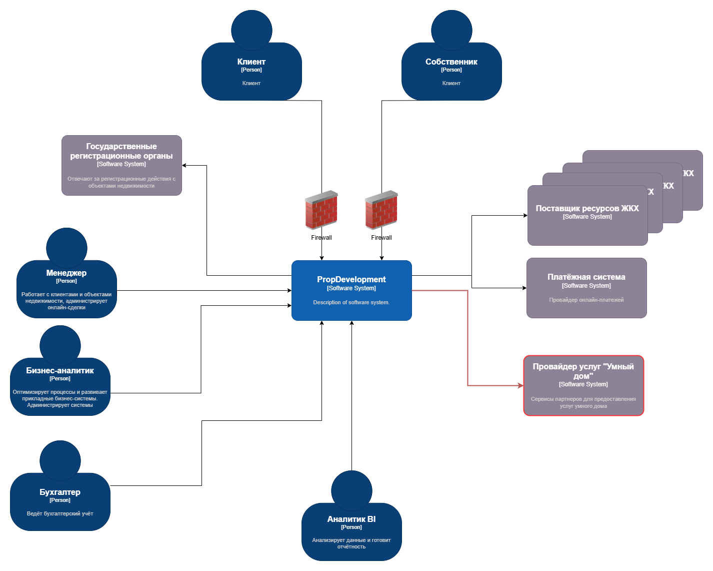
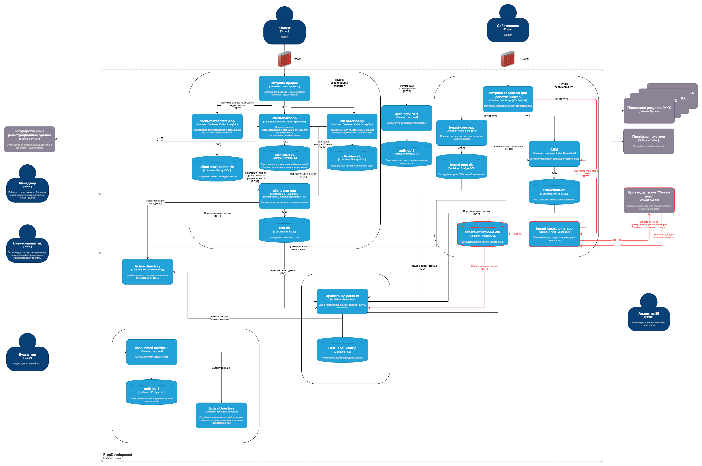

### Требования к безопасности:
- Взаимодействие с внешними компонентами осуществляется через зашифрованные каналы связи (HTTPS/TLS)
- Контроль доступа на уровне ролей (RBAC)
- Обработка и хранение данных (биометрии и данные о номерах автомобилей) должна выполняться в соответствии с корпоративным и законодательным стандартам безопасности (например, 152-ФЗ). Внешняя система не должна хранить персональные данные собственников, а только предоставляет аналитику по видео и фото данным.
- Внедрение системы мониторинга, логирования и аудита. В логах произвести обезличивание и шифрование данных
- Система должна поддерживать защиту от подмены биометрии или автомобильных номеров

### Протоколы аутентификации и авторизации:
- Протокол OAuth 2.0/OIDC для авторизации и аутентификации системами предприятия и внешней платформой
- JWT для идентификации запросов к API

### Организация взаимодействие между системами предприятия и внешней платформой:
Конечные пользователи используют мобильное приложение "Витрина сервисов для собственников". Бизнес-логику взаимодействия с партнерами требуется вынести в отдельный сервис tenant-smarthome-app, с собственной БД для хранения информации о текущих состояний устройств, управления доступов к услугам умного дома, результатах взаимодействия с внешними сервисами. Приложение tenant-smarthome-app получает данные о собственниках и возможности предоставления услуги в CRM системе. База данных tenant-smarthome-db реплицируется в общее хранилище DWH.

Диаграмма контекста:  

Диаграмма контейнеров:  
